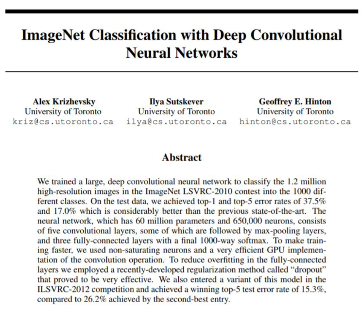
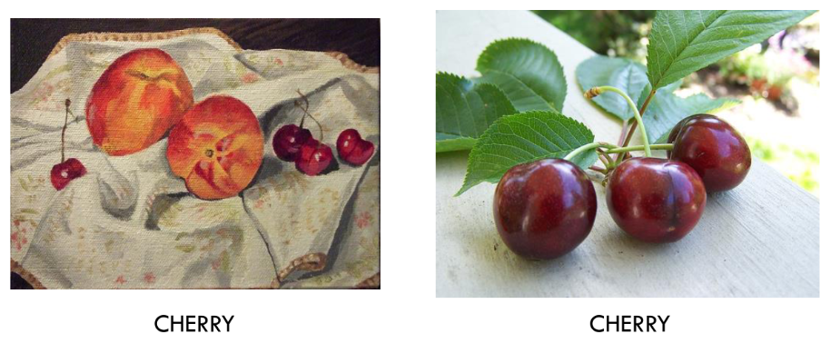

## CNNs

 - **Authors**: Duncan Kirby
 - **Research field**: 
 - **Lesson Topic**: Image classification with CNNs

### The paper that started it all



### The problem: ImageNet large-scale visual recognition challenge

&gt; 1.2 million high-resimages of different sizes to train with
1000 categories

Examples:



### Sources

Original presentation can be found here:
```html
<a href="{{ site.github }}/lessons/CNNs/CNNs.pdf"><u>link</u></a>
```


